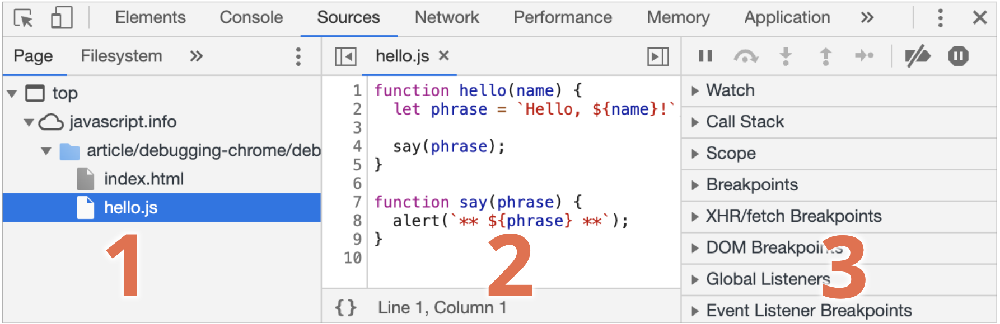
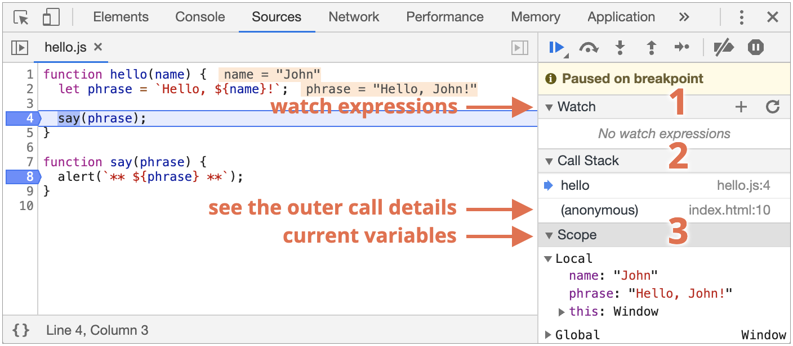

## Chrome으로 디버깅하기

디버깅(debugging)은 스크립트 내 에러를 검출해 제거하는 일련의 과정을 의미합니다. 모던 브라우저와 호스트 환경 대부분은 개발자 도구 안에 UI 형태로 디버깅 툴을 구비해 놓습니다. 디버깅 툴을 사용하면 디버깅이 훨씬 쉬워지고, 실행 단계마다 어떤 일이 일어나는지를 코드 단위로 추적할 수 있습니다.
<br />

### ‘Sources’ 패널


Sources 패널은 크게 세 개의 영역으로 구성됩니다.
1. 파일 탐색 영역 – 페이지를 구성하는 데 쓰인 모든 리소스(HTML, JavaScript, CSS, 이미지 파일 등)를 트리 형태로 보여줍니다. Chrome 익스텐션이 여기 나타날 때도 있습니다.
2. 코드 에디터 영역 – 리소스 영역에서 선택한 파일의 소스 코드를 보여줍니다. 여기서 소스 코드를 편집할 수도 있습니다.
3. 자바스크립트 디버깅 영역 – 디버깅에 관련된 기능을 제공합니다.  
<br />

### debugger 명령어

아래 예시처럼 스크립트 내에 debugger 명령어를 적어주면 중단점을 설정한 것과 같은 효과를 봅니다.

```javascript
function hello(name) {
  let phrase = `Hello, ${name}!`;

  debugger;  // <-- 여기서 실행이 멈춥니다.

  say(phrase);
}
```

debugger 명령어를 사용하면 브라우저를 켜 개발자 도구를 열고 소스 코드 영역을 띄워 중단점을 설정하는 수고를 하지 않아도 됩니다. 에디터를 떠나지 않고도 중단점을 설정할 수 있기 때문에 편리하죠.


이 상태에서 디버깅 영역의 ▼를 클릭해 하위 패널들을 하나씩 펼쳐봅시다. 각 패널은 아래와 같은 기능을 제공합니다.

1. Watch – 표현식을 평가하고 결과를 보여줍니다.
    Add Expression 버튼 +를 클릭해 원하는 표현식을 입력한 후 Enter를 누르면 중단 시점의 값을 보여줍니다. 입력한 표현식은 실행 과정 중에 계속해서 재평가됩니다.

2. Call Stack – 코드를 해당 중단점으로 안내한 실행 경로를 역순으로 표시합니다.
 실행은 index.html 안에서 hello()를 호출하는 과정 중에 멈췄습니다. 함수 hello 내에 중단점을 설정했기 때문에, 콜 스택(Call Stack) 최상단엔 hello가 위치합니다. index.html에서 함수 hello를 정의하지 않았기 때문에 콜 스택 하단엔 'anonymous’가 출력됩니다. 콜 스택 내의 항목을 클릭하면 디버거가 해당 코드로 휙 움직이고, 변수 역시 재평가됩니다. 'anonymous’를 클릭해 직접 확인해 봅시다.

3. Scope – 현재 정의된 모든 변수를 출력합니다.
Local은 함수의 지역변수를 보여줍니다. 지역 변수 정보는 소스 코드 영역에서도 확인(강조 표시)할 수 있습니다.
Global은 함수 바깥에 정의된 전역 변수를 보여줍니다.
Local 하위 항목으로 this에 대한 정보도 출력됩니다.  
<br />

### 스크립트 실행이 중단되는 경우

1. 중단점(breakpoint)을 만났을 때
2. debugger문 만났을 때
3. 에러가 발생했을 때(개발자 도구가 열려있고 예외 발생 시 코드를 자동 중지시켜주는 기능 버튼이 '활성화’되어있는 경우)  
<br />

## 코드 품질

### 좋은 주석

설명이 담긴 주석은 대개 좋지 않습니다. 그럼 좋은 주석이란 무엇일까요?

**아키텍처를 설명하는 주석**  
고차원 수준 컴포넌트 개요, 컴포넌트 간 상호작용에 대한 설명, 상황에 따른 제어 흐름 등은 주석에 넣는 게 좋습니다. 이런 주석은 조감도 역할을 해줍니다. 고차원 수준의 아키텍처 다이어그램을 그리는 데 쓰이는 언어인 UML도 시간을 내어 공부해 보는걸 추천해 드립니다.  

**함수 용례와 매개변수 정보를 담고 있는 주석**  
JSDoc이라는 특별한 문법을 사용하면 함수에 관한 문서를 쉽게 작성할 수 있습니다. 여기엔 함수 용례, 매개변수, 반환 값 정보가 들어갑니다.

```javascript
/**
 * x를 n번 곱한 수를 반환함
 *
 * @param {number} x 거듭제곱할 숫자
 * @param {number} n 곱할 횟수, 반드시 자연수여야 함
 * @return {number} x의 n 거듭제곱을 반환함
 */
function pow(x, n) {
  ...
}
```
이렇게 주석을 달면 코드를 읽어보지 않고도 함수의 목적과 사용법을 한눈에 알 수 있습니다.

**왜 이런 방법으로 문제를 해결했는지를 설명하는 주석**  
무엇이 적혀있는지는 중요합니다. 그런데 무슨 일이 일어나고 있는지 파악하려면 무엇이 적혀있지 않은 지가 더 중요할 수 있습니다. '왜 이 문제를 이런 방법으로 해결했나?'라는 질문에 코드는 답을 해 줄 수 없기 때문입니다.

문제 해결 방법이 여러 가지인데 왜 하필이면 이 방법을 택했는지 의문이 들 때가 있습니다. 선택한 방법이 가장 나은 것도 아닌데 말이죠.

왜 이런 방법을 써서 문제를 해결했는지 알려주는 주석이 없으면 다음과 같은 일이 발생할 수 있습니다.

당신(혹은 동료)은 작성된 후 시간이 꽤 흐른 코드를 열어봅니다. 그리고 그 코드에서 선택한 방식이 ‘가장 좋은 방식은 아니란 걸’ 알아냅니다.
"그때는 내가 멍청했구나. 하지만 지금은 더 똑똑해졌지"라고 생각하며, 이전보단 ‘더 명확하고 올바른’ 방법으로 코드를 개선합니다.
코드를 개선하려는 시도까지는 좋았습니다. 하지만 리팩토링 과정에서 '더 명확’하다고 생각했던 방법을 적용하면 문제가 발생한다는 걸 알아냅니다. 이미 시도해봤던 방법이기 때문에 왜 이 방법이 먹히지 않는지 희미하게 기억이 떠오릅니다. 새로 작성한 코드를 되돌렸지만, 시간이 낭비되었습니다.
해결 방법을 담고 있는 주석은 아주 중요한 역할을 합니다. 이전에 했던 실수를 방지하는 안내판 역할을 하기 때문입니다.

미묘한 기능이 있고, 이 기능이 어디에 쓰이는지를 설명하는 주석
직감에 반하는 미묘한 동작을 수행하는 코드가 있다면 주석을 달아주는 게 좋습니다.  
<br />

### 요약

주석을 보면 좋은 개발자인지 아닌지를 어느 정도 알 수 있습니다. 주석을 언제 쓰고 언제 쓰지 않는지를 보면 되죠.

주석을 잘 작성해 놓으면 시간이 지난 후 코드를 다시 살펴볼 때 효율적으로 정보를 얻을 수 있습니다. 코드 유지보수에 도움이 되죠.

**주석에 들어가면 좋은 내용**

- 고차원 수준 아키텍처
- 함수 용례
- 당장 봐선 명확해 보이지 않는 해결 방법에 대한 설명  

**주석에 들어가면 좋지 않은 내용**

'코드가 어떻게 동작하는지’와 '코드가 무엇을 하는지’에 대한 설명
코드를 간결하게 짤 수 없는 상황이나 코드 자체만으로도 어떤 일을 하는지 충분히 판단할 수 없는 경우에만 주석을 넣으세요.  
<br />

## 테스트 자동화와 Mocha

테스트 자동화는 앞으로 풀어야 할 과제에서뿐만 아니라 현업에서도 광범위하게 쓰입니다.

구체적인 예를 들어봅시다. 현재 함수 f를 구현하고 있다고 가정해보겠습니다. 코드를 작성하고 f(1)이 제대로 동작하는지 확인합니다. 제대로 동작하네요. 그런데 f(2)를 테스트해 보니 제대로 동작하지 않습니다. 코드를 수정한 후 다시 f(2)를 확인해 봅니다. 제대로 동작하네요. 여기서 끝일까요? 아닙니다. f(1)이 제대로 동작하는지 확인하지 않았으니까요. 이렇게 테스트를 수동으로 하면 에러가 발생할 여지를 남깁니다.

이런 일은 아주 흔히 발생합니다. 개발자는 무언가를 만들 때 머릿속에 수많은 유스 케이스를 생각하며 코드를 작성하는데, 코드를 변경해야 할 때마다 모든 유스 케이스를 상기하면서 코드를 수정하는 것은 거의 불가능합니다. 하나를 고치면 또 다른 문제가 튀어나오는 이유가 바로 이 때문입니다.

테스팅 자동화는 테스트 코드가 실제 동작에 관여하는 코드와 별개로 작성되었을 때 가능합니다. 테스트 코드를 이용하면 함수를 다양한 조건에서 실행해 볼 수 있는데, 이때 실행 결과와 기대 결과를 비교할 수 있습니다.

### Behavior Driven Development

Behavior Driven Development(BDD)라 불리는 방법론에 대해 알아봅시다.

BDD는 테스트(test), 문서(documentation), 예시(example)를 한데 모아놓은 개념입니다.  
<br />

### 명세서

본격적으로 코드를 작성하기 전에 먼저 해야 할 것이 있습니다. 코드가 무슨 일을 하는지 상상한 후 이를 자연어로 표현해야 합니다.

이때, 만들어진 산출물을 BDD에선 명세서(specification) 또는 짧게 줄여 스펙(spec) 이라고 부릅니다. 명세서엔 아래와 같이 유스 케이스에 대한 자세한 설명과 테스트가 담겨있습니다.

```javascript
describe("pow", function() {

  it("주어진 숫자의 n 제곱", function() {
    assert.equal(pow(2, 3), 8);
  });

});
```

스펙은 세 가지 주요 구성 요소로 이루어집니다.

**describe("title", function() { ... })**  
구현하고자 하는 기능에 대한 설명이 들어갑니다. 우리 예시에선 함수 pow가 어떤 동작을 하는지에 대한 설명이 들어갈 겁니다. it 블록을 한데 모아주는 역할도 합니다.

**it("유스 케이스 설명", function() { ... })**  
it의 첫 번째 인수엔 특정 유스 케이스에 대한 설명이 들어갑니다. 이 설명은 누구나 읽을 수 있고 이해할 수 있는 자연어로 적어줍니다. 두 번째 인수엔 유스 케이스 테스트 함수가 들어갑니다.

**assert.equal(value1, value2)**  
기능을 제대로 구현했다면 it 블록 내의 코드 assert.equal(value1, value2)이 에러 없이 실행됩니다.

함수 assert.*는 pow가 예상한 대로 동작하는지 확인해줍니다. 위 예시에선 assert.equal이 사용되었는데, 이 함수는 인수끼리 동등 비교했을 때 다르다고 판단되면 에러를 반환합니다. 예시에선 pow(2, 3)의 결괏값과 8을 비교하겠죠. 비교나 확인에 쓰이는 다른 함수들은 아래에서 다시 소개해 드리겠습니다.

명세서는 실행 가능합니다. 명세서를 실행하면 it 블록 안의 테스트가 실행됩니다.

BDD에선 스펙을 먼저 작성하고 난 후에 구현을 시작합니다. 구현이 종료된 시점에는 스펙과 코드 둘 다를 확보할 수 있습니다.  
<br />

**스펙의 용도는 세 가지입니다.**

1. 테스트 – 함수가 의도하는 동작을 제대로 수행하고 있는지 보장함
2. 문서 – 함수가 어떤 동작을 수행하고 있는지 설명해줌. describe와 it에 설명이 들어감
3. 예시 – 실제 동작하는 예시를 이용해 함수를 어떻게 사용할 수 있는지 알려줌  

스펙이 있기 때문에 개발자는 안전하게 함수를 개선하거나 변경할 수 있습니다. 함수를 처음부터 다시 작성해야 하는 경우가 생겨도 스펙이 있으면 기존 코드와 동일하게 동작한다는 것을 보장할 수 있습니다.

코드가 바뀌어도 기존에 구현된 기능에 영향을 주지 않게 하는 건 대규모 프로젝트에서 매우 중요합니다. 프로젝트 규모가 커지면 함수 하나를 이곳저곳에서 사용하는데, 수동으로 변경된 함수가 이 함수를 사용하는 모든 곳에서 제대로 동작하는지 확인하는 건 불가능하기 때문입니다.

테스트를 하지 않고 코드를 작성해왔다면 개발자들은 둘 중 한 갈래의 길로 빠져버리고 맙니다.

아무 대책 없이 코드를 변경합니다. 부작용을 생각하지 않고 함수를 수정했기 때문에 어디선가 버그가 발생하고 맙니다.
수정이나 개선을 기피하게 됩니다. 버그의 대가가 가혹하기 때문이죠. 코드가 구식이 되어도 그 누구도 코드를 건드리려 하지 않습니다. 좋지 않은 상황이죠.
**테스팅 자동화는 이런 문제를 피하게 도와줍니다!**

테스팅 자동화를 수행하고 있는 프로젝트라면 이런 문제를 걱정하지 않아도 됩니다. 코드에 변화가 있어도 스펙을 실행해 테스트를 진행하면 몇 초 만에 에러 발생 여부를 확인할 수 있습니다.

장점이 하나 더 있습니다. **잘 테스트 된 코드는 더 나은 아키텍처를 만듭니다.**  
<br />

### 폴리필

자바스크립트는 끊임없이 진화하는 언어입니다. 새로운 제안(proposal)이 정기적으로 등록, 분석되고, 가치가 있다고 판단되는 제안은 https://tc39.github.io/ecma262/에 추가됩니다. 그리고 궁극적으로 명세서(specification)에 등록됩니다.

자바스크립트 엔진을 만드는 각 조직은 나름대로 우선순위를 매겨 명세서 내 어떤 기능을 먼저 구현할지 결정합니다. 명세서에 등록된 기능보다 초안(draft)에 있는 제안을 먼저 구현하기로 결정하는 경우도 있습니다. 구현 난도가 높아서 이런 결정을 내리는 경우도 있지만, 구미를 당기지 않아 이런 결정을 내리기도 합니다.

엔진이 표준 전체를 지원하지 않고 일부만 지원하는 건 흔한 일이죠.  
<br />

### 바벨

명세서에 등록된 지 얼마 안 된 기능을 사용해 코드를 작성하다 보면 특정 엔진에서 우리가 작성한 코드를 지원하지 않는다는 걸 알게 되는 경우가 있습니다. 명세서 내 모든 기능을 모든 엔진이 구현하고 있지 않기 때문이죠.

이럴 때 바벨을 사용할 수 있습니다.

바벨(Babel)은 트랜스파일러(transpiler)로, 모던 자바스크립트 코드를 구 표준을 준수하는 코드로 바꿔줍니다.

바벨의 주요 역할은 다음과 같습니다.

1. 트랜스파일러 – 바벨은 코드를 재작성해주는 트랜스파일러 프로그램입니다. 바벨은 개발자의 컴퓨터에서 돌아가는데, 이를 실행하면 기존 코드가 구 표준을 준수하는 코드로 변경됩니다. 변경된 코드는 웹사이트 형태로 사용자에게 전달됩니다. 웹팩(webpack)과 같은 모던 프로젝트 빌드 시스템은 코드가 수정될 때마다 자동으로 트랜스파일러를 동작시켜줍니다. 이런 과정이 없으면 개발이 끝난 코드를 한데 통합하는 데 어려움이 있을 수 있습니다.

2. 폴리필  
   명세서엔 새로운 문법이나 기존에 없던 내장 함수에 대한 정의가 추가되곤 합니다. 새로운 문법을 사용해 코드를 작성하면 트랜스파일러는 이를 구 표준을 준수하는 코드로 변경해줍니다. 반면, 새롭게 표준에 추가된 함수는 명세서 내 정의를 읽고 이에 맞게 직접 함수를 구현해야 사용할 수 있습니다. 자바스크립트는 매우 동적인 언어라서 원하기만 하면 어떤 함수라도 스크립트에 추가할 수 있습니다. 물론 기존 함수를 수정하는 것도 가능합니다. 개발자는 스크립트에 새로운 함수를 추가하거나 수정해서 스크립트가 최신 표준을 준수 할 수 있게 작업할 수 있습니다.  
   이렇게 변경된 표준을 준수할 수 있게 기존 함수의 동작 방식을 수정하거나, 새롭게 구현한 함수의 스크립트를 "폴리필(polyfill)"이라 부릅니다. 폴리필(polyfill)은 말 그대로 구현이 누락된 새로운 기능을 메꿔주는(fill in) 역할을 합니다.

주목할 만한 폴리필 두 가지는 아래와 같습니다.

- core js – 다양한 폴리필을 제공합니다. 특정 기능의 폴리필만 사용하는 것도 가능합니다.
- polyfill.io – 기능이나 사용자의 브라우저에 따라 폴리필 스크립트를 제공해주는 서비스입니다.
모던 자바스크립트를 이용해 스크립트를 작성하려면 트랜스파일러와 폴리필은 필수입니다.
